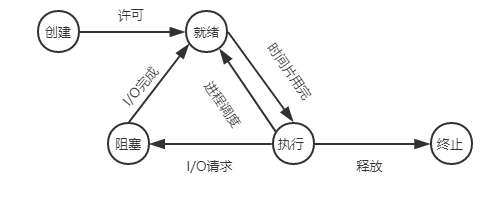
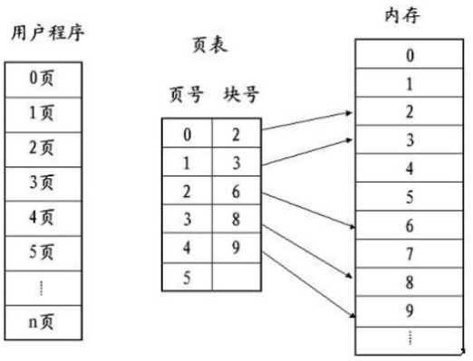
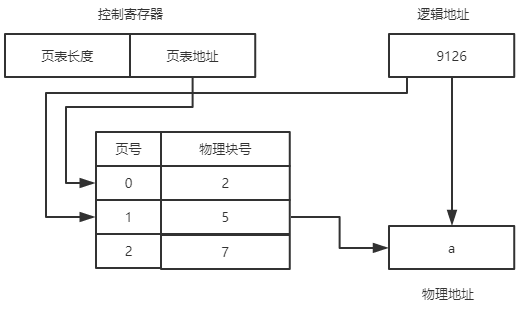

+ **<font size = 5>线程和进程的区别</font>**

    进程是资源**分配**的独立单位;线程是资源**调度**的独立单位。一个进程崩溃后，在保护模式下不会对其它进程产生影响，而线程只是进程中的不同执行路径。线程有自己的堆栈和局部变量，没有自己独立的地址空间，一个线程死掉等于整个进程死掉，进程切换资源消耗较大，效率要差。


    - **进程**私有资源：地址空间，堆，全局变量，栈，寄存器
    - **进程**共享资源：代码段，公共数据，进程目录，进程ID
    - **线程**私有资源：线程栈，寄存器，程序寄存器
    - **线程**共享资源：堆，**地址空间**，全局变量，静态变量


+ **<font size = 5>多线程和多进程的对比，什么时候选择线程什么时候选择进程</font>**


    线程和进程对比表格汇总
    
    
    | 对比内容| 多进程 | 多线程|
    | :----------| :--------- |:--------- |
    |数据共享|数据共享复制，需要借助IPC(进程间通讯方式)|统一进程下，线程共享进程数据，数据分享简单| 
    |同步|数据是分开的，同步简单|数据共享，同步复杂|
    |内存CPU|占用内存多，切换复杂，CPU利用率低|占用内存少，切换简单，CPU利用率高|
    |创建销毁，切换|创建销毁，切换都比较复杂|创建销毁切换都比较简单|
    |编程难度|编程简单|编程复杂|
    |可靠性|进程间不会相互影响|一个线程挂掉将导致整个进程挂掉|
    |扩展性|适应于多核，多机分布式；一台机器不够用，扩展到多机上比较简单|适用于多核分布式|
    - 需要频繁创建销毁的优先使用线程
    - 需要进行大量计算的优先使用线程
    - 强相关的处理用线程，弱相关的处理用进程
    - 可能要扩展到多机分布的用进程，多核分布的用线程
+ **<font size = 5>进程的五状态模型</font>**

    


    -   创建态：向进程申请一个空白的PCB(process control block),并向PCB中填写用于控制和管理进程的信息，为该进程分配运行时所必须的资源

    -   就绪态：进程已处于准备好的状态，及进程已经分配到所需的系统资源，只要获得CPU就可以执行
    -   执行态：进程获得CPU正在执行
    -   阻塞态：正在执行的进程，在执行过程中需要等待其它资源的到达，如：I/O请求，申请缓冲区失败等
    -   终止态：进程结束


+ **<font size = 5>进程间的通信方式以及优缺点</font>**

    主要包括无名管道，有名管道，信号，消息队列，共享内存，信号量和套接字

    1.  无名管道
        -   半双工的，具有固定的读端和写端
        -   它只能用于具有亲缘关系的进程之间的通信
        -   是一种特殊的文件， 不属于文件系统，只存在于内存中
        使用例子如下
        ```
        #include<stdio.h>
        #include<unistd.h>
        int main()
        {
            int fd[2];  // 两个文件描述符
            pid_t pid;
            char buff[20];

            if(pipe(fd) < 0)  // 创建管道
                printf("Create Pipe Error!\n"); 
            if((pid = fork()) < 0)  // 创建子进程
                printf("Fork Error!\n");
            else if(pid > 0)  // 父进程
            {
                close(fd[0]); // 关闭读端
                write(fd[1], "hello world\n", 12);
            }
            else
            {
                close(fd[1]); // 关闭写端
                read(fd[0], buff, 20);
                printf("%s", buff);
            }
 
            return 0;
        }
        ```
    2.  有名管道
        -   无关进程之间也可以交换数据
        -   它以一种特殊的设备文件形式存在系统中
        有名管道的通信类似于进程中使用文件来传输交换数据，在数据读出时，同时会清除数据，并且先进先出。以下两份代码演示不同进程间使用有名管道的通信方式
        ```
        //write_fifo.c
        #include<stdio.h>
        #include<stdlib.h>   // exit
        #include<fcntl.h>    // O_WRONLY
        #include<sys/stat.h>
        #include<time.h>     // time
        int main()
        {
            int fd;
            int n, i;
            char buf[1024];
            time_t tp;

            printf("I am %d process.\n", getpid()); // 说明进程ID
            if((fd = open("fifo1", O_WRONLY)) < 0) // 以写打开一个FIFO 
            {
                perror("Open FIFO Failed");
                exit(1);
            }
 
            for(i=0; i<10; ++i)
            {
                time(&tp);  // 取系统当前时间
                n=sprintf(buf,"Process %d's time is %s",getpid(),ctime(&tp));
                printf("Send message: %s", buf); // 打印
                if(write(fd, buf, n+1) < 0)  // 写入到FIFO中
                {
                    perror("Write FIFO Failed");
                    close(fd);
                    exit(1);
                }
                sleep(1);  // 休眠1秒
            }
            close(fd);  // 关闭FIFO文件
            return 0;
        }
        ```
        ```
        //read_fifo.c
        #include<stdio.h>
        #include<stdlib.h>
        #include<errno.h>
        #include<fcntl.h>
        #include<sys/stat.h>
        int main()
        {
            int fd;
            int len;
            char buf[1024];
            if(mkfifo("fifo1", 0666) < 0 && errno!=EEXIST) // 创建FIFO管道
                perror("Create FIFO Failed");

            if((fd = open("fifo1", O_RDONLY)) < 0)  // 以读打开FIFO
            {
                perror("Open FIFO Failed");
                exit(1);
            }
            while((len = read(fd, buf, 1024)) > 0) // 读取FIFO管道
                printf("Read message: %s", buf);
            close(fd);  // 关闭FIFO文件
            return 0;
        }
        ```


    3.  消息队列

        消息队列是消息的链接表，存放在内核中
        -   消息队列是面向记录的，其中的消息具有特定的格式以及特定的优先级
        -   消息队列独立于发生和接收进程。进程终止时，消息队列及其内容不会被删除
        -   消息队列可以实现消息的**随机查询**，消息不一定要以先进先出的次序读取

        函数原型
        ```
        #include <sys/msg.h>
        // 创建或打开消息队列：成功返回队列ID，失败返回-1
        int msgget(key_t key, int flag);
        // 添加消息：成功返回0，失败返回-1
        int msgsnd(int msqid, const void *ptr, size_t size, int flag);
        // 读取消息：成功返回消息数据的长度，失败返回-1
        int msgrcv(int msqid, void *ptr, size_t size, long type,int flag);
        // 控制消息队列：成功返回0，失败返回-1
        int msgctl(int msqid, int cmd, struct msqid_ds *buf);
        ```
    4. 信号量

        它是一个计数器，主要用于进程间的互斥和同步，而不是用于存储进程间通信数据

        -   信号量用于进程间同步，若要在进程间传递数据需要结合共享内存
        -   信号量基于操作系统的PV操作，程序对信号量的操作都是原子操作

        最简单的信号量是只能取 0 和 1 的变量，这也是信号量最常见的一种形式，叫做二值信号量（Binary Semaphore）。而可以取多个正整数的信号量被称为通用信号量。Linux 下的信号量函数都是在通用的信号量数组上进行操作，而不是在一个单一的二值信号量上进行操作。
        ```
        #include <sys/sem.h>
        // 创建或获取一个信号量组：若成功返回信号量集ID，失败返回-1
        int semget(key_t key, int num_sems, int sem_flags);
        // 对信号量组进行操作，改变信号量的值：成功返回0，失败返回-1
        int semop(int semid, struct sembuf semoparray[], size_t numops);  
        // 控制信号量的相关信息
        int semctl(int semid, int sem_num, int cmd, ...);
        ```

    5.  共享内存

        共享内存指两个或多个进程共享一个给定的存储区
        -   共享内存是最快的一种 IPC，因为进程是直接对内存进行存取。
        -   因为多个进程可以同时操作，所以需要进行同步。
        -   信号量+共享内存通常结合在一起使用，信号量用来同步对共享内存的访问。

    6.  套接字
    
        它用于不同机器之间进程的通信
    

        各种进程间通信方式对比优缺点


        | 通信方式| 优缺点|
        | :-----:| :--------- |
        |无名管道|速度慢，容量有限，只有父子进程能通讯|
        |有名管道|任何进程间都能通讯，但速度慢|
        |消息队列|容量受到系统限制，且要注意第一次读的时候，要考虑上一次没有读完数据的问题，消息队列可以不再局限于父子进程，而允许任意进程通过共享消息队列来实现进程间通信，并由系统调用函数来实现消息发送和接收之间的同步，从而使得用户在使用消息缓冲进行通信时不再需要考虑同步问题，使用方便，但是信息的复制需要额外消耗CPU的时间，不适宜于信息量大或操作频繁的场合。**此种方法不太常用**|
        |信号量|不能用来传递复杂消息，只能用来同步|
        |共享内存|利用内存缓冲区直接交换信息，无须复制，快捷、信息量大是其优点。共享内存块提供了在任意数量的进程之间进行高效双向通信的机制。每个使用者都可以读取写入数据，但是所有程序之间必须达成并遵守一定的协议，以防止诸如在读取信息之前覆写内存空间等竞争状态的出现。|


    通信方式的选择

    -   PIPE和FIFO(有名管道)用来实现进程间相互发送非常短小的、频率很高的消息，这两种方式通常适用于两个进程间的通信
    -   共享内存用来实现进程间共享的、非常庞大的、读写操作频率很高的数据；这种方法适用于多进程间的通信
    -   其他考虑用socket。主要应用在分布式开发中


+ **<font size = 5>线程间的通信方式</font>**


    线程间通信主要用于线程同步，所以线程没有像进程通信中的用于数据交换的通信机制
    -   锁机制：包括互斥锁，条件变量，读写锁；互斥锁提供了排它方式方式数据被并发的修改，读写锁允许多个线程同时读取共享数据，而对写操作是互斥的。条件变量可以以原子的方式阻塞线程，知道某个条件为真

    -   信号量机制
    -   信号机制


+ **<font size = 5>虚拟存储</font>**

    虚拟存储技术是指进程运行时，先将一部分装入内存，另一部分暂存磁盘，当要执行的指令或访问的数据不在内存中时，由操作系统自动将他们从磁盘调入内存中工作


+ **<font size = 5>分页分段和段页式存储</font>**


    连续分配方式会形成很多“碎片”，如果允许一个进程分散地装入到许多不相邻接的分区中，便可以充分地利用空间。
    

    1.  分页存储

        用户进程的地址空间被划分成若干固定大小的区域，称为“页”，相应地，内存空间分成若干个物理块，页和块的大小相等。可以将用户程序的任意页放在内存任意块中，实现离散分配。程序的各个逻辑页面从0开始依次编号，每个页面内从0开始编址，称为页内地址；

       

        页表：分页系统中，允许将进程的每一页离散地存储在内存的任一物理块中，为了能在内存中找到每个页面对应的物理块，系统为每个进程建立一张页表，用于记录进程逻辑页面与内存物理页面之间的对应关系。页表的作用是实现从页号到物理块号的地址映射，地址空间有多少页，该页表里就登记多少行，且按逻辑页的顺序排列，形如：
        
        

        程序中的逻辑地址由两部分组成：页号P和页内偏移量W。

         

        逻辑地址和物理地址转换，假设逻辑地址9126，页面大小4K,页表如下所示

        页号：9126/4096 = 2；页内偏移：9126%4096=934；物理地址 = 物理块号*页面大小 + 页内偏移

        


+ **<font size = 5>页面置换算法</font>**


    在地址映射过程中，若在页面中发现所要访问的页面不在内存中，则产生缺页中断。当缺页中断时，如果操作系统中内存中没有空闲页面，则操作系统必须在内存选择一个页面将其移除内存，以便为即将调入的页面让出空间。主要包括有以下几种页面置换算法

    -   **最佳置换算法（OPT）**：从主存中移出永远不再需要的页面；如无这样的页面存在，则选择最长时间不需要访问的页面。于所选择的被淘汰页面将是以后永不使用的，或者是在最长时间内不再被访问的页面，这样可以保证获得最低的缺页率。(**理想情况下的页面置换算法，但是实际上不可能实现**) 
    -   **先进先出置换算法**：是最简单的页面置换算法。这种算法的基本思想是：当需要淘汰一个页面时，总是选择驻留主存时间最长的页面进行淘汰，即先进入主存的页面先淘汰。其理由是：最早调入主存的页面不再被使用的可能性最大。 
    -   **最近最久未使用算法**：这种算法的基本思想是：利用局部性原理，根据一个作业在执行过程中过去的页面访问历史来推测未来的行为。它认为过去一段时间里不曾被访问过的页面，在最近的将来可能也不会再被访问。所以，这种算法的实质是：当需要淘汰一个页面时，总是选择在最近一段时间内最久不用的页面予以淘汰。
    -   **时钟置换算法**：简单的CLOCK算法是给每一帧关联一个附加位，称为使用位。当某一页首次装入主存时，该帧的使用位设置为1;当该页随后再被访问到时，它的使用位也被置为1。对于页替换算法，用于替换的候选帧集合看做一个循环缓冲区，并且有一个指针与之相关联。当某一页被替换时，该指针被设置成指向缓冲区中的下一帧。当需要替换一页时，操作系统扫描缓冲区，以查找使用位被置为0的一帧。每当遇到一个使用位为1的帧时，操作系统就将该位重新置为0；如果在这个过程开始时，缓冲区中所有帧的使用位均为0，则选择遇到的第一个帧替换；如果所有帧的使用位均为1,则指针在缓冲区中完整地循环一周，把所有使用位都置为0，并且停留在最初的位置上，替换该帧中的页。由于该算法循环地检查各页面的情况，故称为CLOCK算法，又称为最近未用(Not Recently Used, NRU)算法。


+ **<font size = 5>什么是协程？</font>**


