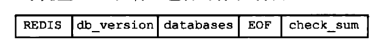
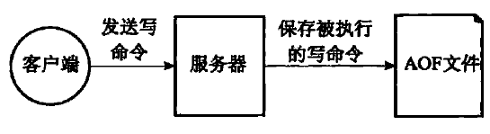
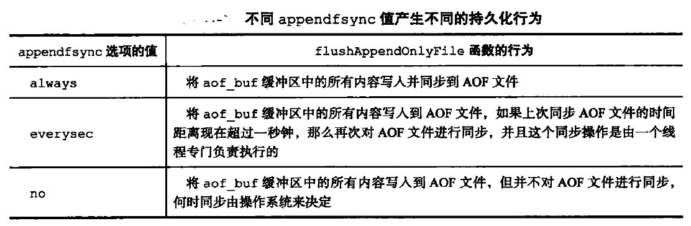

+ **redis常用的几种数据结构**

    -   String: 字符数组SDS，存储空间预分配，二进制安全（可以包含任意数据，比如jpeg最大能存储512Mb）
    -   List：
    -   Hash: 
    -   Set：
    -   Zset：

+ **redis是怎么解决hash冲突的，rehash是什么**

    redis中使用的是拉链法来解决冲突，对于每个val其实是一个链表，映射到同一个位置的key,如果已经有内容，会接到后面去。redis中字典里面有两个哈希表（正常情况下，只使用第一个），如果第一个哈希表的负载因子（负载因子=哈希表的总元素/哈希表长度)比较大或者比较小的时候,就需要借助第二个哈希表进行rehash操作。对于负载因子比较大的时候，需要增大hash表，大小变为当前哈希表元素数量的2倍，并且是2的整数次幂，对于负载因子比较小的时候(小于1),需要收缩hash表，大小为当前哈希表元素数量2的整数次幂（3变成4，5变成8）。但是考虑到效率问题，redis做rehash操作的时候，不会一次性做完，会选择分批次，渐进式完成，利用一个rehashdx来标志现在是否在进行hash操作。在进行rehash时，针对键的查找可能要在两个哈希表中进行。

+ **redis跳跃表**

+ **redis跳跃表(skiplist)和平衡树哈希表的比较**

    -   skiplist和各种平衡树（如AVL、红黑树等）的元素是有序排列的，而哈希表不是有序的。因此，在哈希表上只能做单个key的查找，不适宜做范围查找。所谓范围查找，指的是查找那些大小在指定的两个值之间的所有节点。
    -   在做范围查找的时候，平衡树比skiplist操作要复杂。在平衡树上，我们找到指定范围的小值之后，还需要以中序遍历的顺序继续寻找其它不超过大值的节点。如果不对平衡树进行一定的改造，这里的中序遍历并不容易实现。而在skiplist上进行范围查找就非常简单，只需要在找到小值之后，对第1层链表进行若干步的遍历就可以实现。

    -   平衡树的插入和删除操作可能引发子树的调整，逻辑复杂，而skiplist的插入和删除只需要修改相邻节点的指针，操作简单又快速。

    -   从内存占用上来说，skiplist比平衡树更灵活一些。一般来说，平衡树每个节点包含2个指针（分别指向左右子树），而skiplist每个节点包含的指针数目平均为1/(1-p)，具体取决于参数p的大小。如果像Redis里的实现一样，取p=1/4，那么平均每个节点包含1.33个指针，比平衡树更有优势。

    -   查找单个key，skiplist和平衡树的时间复杂度都为O(log n)，大体相当；而哈希表在保持较低的哈希值冲突概率的前提下，查找时间复杂度接近O(1)，性能更高一些。所以我们平常使用的各种Map或dictionary结构，大都是基于哈希表实现的。

    -   从算法实现难度上来比较，skiplist比平衡树要简单得多。

+ **redis的RDB持久化**

    redis有两个命令用来生成RDB文件，一个是SAVE,另一个是BGSAVE。不同在于SAVE会阻塞主进程，直到RDB文件创建为止，服务器阻塞期间不处理任何命令。BGSAVE命令会派生出一个子进程，由子进程来负责创建RDB文件，父进程继续处理命令请求。RDB持久化是记录当前数据库的数据

    RDB文件结构：最开头保存着REDIS五个字符，第二个表示当前数据库版本，databases可能包含有多个数据库,EOF常量标志RDB文件结束，check_sum表示记录的校验和

    

    Databases部分：SELECTDB表示接下来要读的是一个数据库的号码，db_number表示数据库编号，key_value_pairs表示数据库中所有的键值对。

    

    key_value_pairs:如果键值对有过期时间的话，那么键值对的过期时间也会被保存在内。对于不带过期时间的由TYPE,key,value三部分组成。TYPE记录value的类型，

    

    对于有过期时间的键值对，如下所示

    

+ **redis的AOF持久化**

    AOF(Append Only File)通过保存Redis服务器所执行的写命令来记录数据库状态。

    

    AOF持久化功能的实现分为**命令追加，文件写入，文件同步**三个步骤

    命令追加：AOF持久化功能开启时，服务器在执行完一个写命令后，会以协议格式将被执行的写命令追加到服务器状态的aof_buf缓冲区末尾

    文件写入与同步：Redis的服务进程就是一个事件循环，在服务器每结束y一个事件循环之前，会调用flushAppendOnlyFile函数，将aof_buf缓冲区的内容写入和保存到AOF文件里面。但是flushAppendOnlyFile函数由服务器配置appendsync选项的值来决定

    

    AOF重写是指在AOF持久化过程中，命令越多，AOF文件中的内容越来越多，对数据库还原需要更多的时间，新的AOF就是为了解决AOF文件膨胀的问题，新的AOF文件没有包含任何冗余命令

+ **热点key是什么东西，怎么解决**

    热点key：缓存中的某些Key(可能对应用与某个促销商品)对应的value存储在集群中一台机器，使得所有流量涌向同一机器，成为系统的瓶颈，该问题的挑战在于它无法通过增加机器容量来解决。

    热点key解决方案：
    -   客户端热点key缓存：将热点key对应value并缓存在客户端本地，并且设置一个失效时间。对于每次读请求，将首先检查key是否存在于本地缓存中，如果存在则直接返回，如果不存在再去访问分布式缓存的机器。
    -   将热点key分散为多个子key，然后存储到缓存集群的不同机器上，这些子key对应的value都和热点key是一样的。当通过热点key去查询数据时，通过某种hash算法随机选择一个子key，然后再去访问缓存机器，将热点分散到了多个子key上。

+ **Redis为什么快**

    -   存内存操作
    -   单线程没有线程上下文切换的开销
    -   高效的数据结构
    

